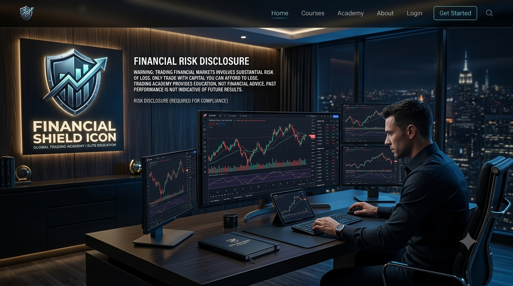

  <!-- Dynamic Typing Banner Header -->
  

    

  <!-- Banner Prensipal Site la -->
  

    

  <!-- Badges Kontak & Sosyal -->
  
  
  
  

---

## 📖 𝐀𝐁𝐎𝐔𝐓 𝐓𝐇𝐄 𝐏𝐋𝐀𝐓𝐅𝐎𝐑𝐌

> 𝚎𝚡𝚊𝚖𝚙𝚕𝚎: 𝚆𝚎𝚕𝚌𝚘𝚖𝚎 𝚝𝚘 𝚝𝚑𝚎 𝚘𝚏𝚏𝚒𝚌𝚒𝚊𝚕 𝚛𝚎𝚙𝚘𝚜𝚒𝚝𝚘𝚛𝚢 𝚘𝚏 𝐙𝐀𝐘𝐕𝐄𝐍 𝐂𝐑𝐔𝐙 𝐓𝐑𝐀𝐃𝐈𝐍𝐆 𝐀𝐂𝐀𝐃𝐄𝐌𝐘. 𝚃𝚑𝚒𝚜 𝚠𝚎𝚋𝚜𝚒𝚝𝚎 𝚠𝚊𝚜 𝚎𝚗𝚐𝚒𝚗𝚎𝚎𝚛𝚎𝚍 𝚝𝚘 𝚜𝚎𝚛𝚟𝚎 𝚊𝚜 𝚊 𝚠𝚘𝚛𝚕𝚍-𝚌𝚕𝚊𝚜𝚜 𝚑𝚞𝚋 𝚏𝚘𝚛 𝚝𝚛𝚊𝚍𝚎𝚛𝚜 𝚜𝚎𝚎𝚔𝚒𝚗𝚐 𝚙𝚛𝚘𝚏𝚎𝚜𝚜𝚒𝚘𝚗𝚊𝚕 𝚎𝚍𝚞𝚌𝚊𝚝𝚒𝚘𝚗, 𝚝𝚎𝚌𝚑𝚗𝚒𝚌𝚊𝚕 𝚊𝚗𝚊𝚕𝚢𝚜𝚒𝚜, 𝚊𝚗𝚍 𝚛𝚎𝚊𝚕-𝚝𝚒𝚖𝚎 𝚖𝚊𝚛𝚔𝚎𝚝 𝚎𝚡𝚎𝚌𝚞𝚝𝚒𝚘𝚗.

* 🎯 **𝐌𝐢𝐬𝐬𝐢𝐨𝐧:** 𝚎𝚡𝚊𝚖𝚙𝚕𝚎: 𝚃𝚘 𝚎𝚖𝚙𝚘𝚠𝚎𝚛 𝚒𝚗𝚍𝚒𝚟𝚒𝚍𝚞𝚊𝚕𝚜 𝚠𝚒𝚝𝚑 𝚊𝚍𝚟𝚊𝚗𝚌𝚎𝚍 𝚝𝚛𝚊𝚍𝚒𝚗𝚐 𝚜𝚝𝚛𝚊𝚝𝚎𝚐𝚒𝚎𝚜, 𝚙𝚛𝚘𝚙𝚛𝚒𝚎𝚝𝚊𝚛𝚢 𝚒𝚗𝚍𝚒𝚌𝚊𝚝𝚘𝚛𝚜, 𝚊𝚗𝚍 𝚜𝚝𝚛𝚒𝚌𝚝 𝚛𝚒𝚜𝚔 𝚖𝚊𝚗𝚊𝚐𝚎𝚖𝚎𝚗𝚝 𝚏𝚛𝚊𝚖𝚎𝚡𝚘𝚛𝚔𝚜.
* 💡 **𝐏𝐡𝐢𝐥𝐨𝐬𝐨𝐩𝐡𝐲:** 𝐞𝐱𝐚𝐦𝐩𝐥𝐞: "𝐍𝐎 𝐑𝐈𝐒𝐊. 𝐍𝐎 𝐒𝐓𝐎𝐑𝐘." — 𝚎𝚡𝚊𝚖𝚙𝚕𝚎: 𝙵𝚒𝚗𝚊𝚗𝚌𝚒𝚊𝚕 𝚐𝚛𝚘𝚠𝚝𝚑 𝚛𝚎𝚚𝚞𝚒𝚛𝚎𝚜 𝚌𝚊𝚕𝚌𝚞𝚕𝚊𝚝𝚎𝚍 𝚌𝚘𝚞𝚛𝚊𝚐𝚎, 𝚊𝚕𝚐𝚘𝚛𝚒𝚝𝚑𝚖𝚒𝚌 𝚙𝚛𝚎𝚌𝚒𝚜𝚒𝚘𝚗, 𝚊𝚗𝚍 𝚞𝚗𝚠𝚊𝚟𝚎𝚛𝚒𝚗𝚐 𝚍𝚒𝚜𝚌𝚒𝚙𝚕𝚒𝚗𝚎.

 

  
  

---

## 🚀 𝐂𝐎𝐑𝐄 𝐀𝐂𝐀𝐃𝐄𝐌𝐘 𝐅𝐄𝐀𝐓𝐔𝐑𝐄𝐒

1. 📘 **𝟓𝟎-𝐏𝐚𝐠𝐞 𝐈𝐧𝐭𝐞𝐫𝐚𝐜𝐭𝐢𝐯𝐞 𝐓𝐫𝐚𝐝𝐢𝐧𝐠 𝐄-𝐁𝐨𝐨𝐤**
   * 𝚎𝚡𝚊𝚖𝚙𝚕𝚎: 𝙲𝚘𝚖𝚙𝚛𝚎𝚑𝚎𝚗𝚜𝚒𝚟𝚎 𝚐𝚞𝚒𝚍𝚎 𝚌𝚘𝚟𝚎𝚛𝚒𝚗𝚐 𝙱𝚒𝚗𝚊𝚛𝚢 𝙾𝚙𝚝𝚒𝚘𝚗𝚜, 𝙲𝚊𝚗𝚍𝚕𝚎𝚜𝚝𝚒𝚌𝚔 𝙰𝚗𝚊𝚝𝚘𝚖𝚢, 𝙿𝚛𝚒𝚌𝚎 𝙰𝚌𝚝𝚒𝚘𝚗, 𝚊𝚗𝚍 𝙿𝚘𝚌𝚔𝚎𝚝 𝙾𝚙𝚝𝚒𝚘𝚗 𝚒𝚗𝚍𝚒𝚌𝚊𝚝𝚘𝚛 𝚜𝚎𝚝𝚞𝚙𝚜.
2. 🎯 **𝐉𝐚𝐲𝐰𝐢𝐧 𝐒𝐧𝐢𝐩𝐞𝐫 & 𝐖𝐨𝐨𝐣𝐚𝐲 𝐀𝐥𝐠𝐨𝐫𝐢𝐭𝐡𝐦𝐬**
   * 𝚎𝚡𝚊𝚖𝚙𝚕𝚎: 𝙿𝚛𝚘𝚙𝚛𝚒𝚎𝚝𝚊𝚛𝚢 𝚖𝚊𝚛𝚔𝚎𝚝-𝚊𝚗𝚊𝚕𝚢𝚜𝚒𝚜 𝚝𝚘𝚘𝚕𝚜 𝚘𝚙𝚝𝚒𝚖𝚒𝚣𝚎𝚍 𝚏𝚘𝚛 𝚑𝚒𝚐𝚑-𝚙𝚛𝚘𝚋𝚊𝚋𝚒𝚕𝚒𝚝𝚢 𝚎𝚗𝚝𝚛𝚢 𝚙𝚘𝚒𝚗𝚝𝚜 𝚊𝚗𝚍 𝚝𝚛𝚎𝚗𝚍 𝚛𝚎𝚟𝚎𝚛𝚜𝚊𝚕𝚜.
3. 🎥 **𝐖𝐞𝐞𝐤𝐥𝐲 𝐋𝐢𝐯𝐞 𝐙𝐨𝐨𝐦 𝐓𝐫𝐚𝐝𝐢𝐧𝐠 𝐑𝐨𝐨𝐦𝐬**
   * 𝚎𝚡𝚊𝚖𝚙𝚕𝚎: 𝚁𝚎𝚊𝚕-𝚝𝚒𝚖𝚎 𝚌𝚑𝚊𝚛𝚝 𝚊𝚗𝚊𝚕𝚢𝚜𝚒𝚜, 𝚕𝚒𝚟𝚎 𝚜𝚒𝚐𝚗𝚊𝚕 𝚎𝚡𝚎𝚌𝚞𝚝𝚒𝚘𝚗, 𝚊𝚗𝚍 𝚠𝚎𝚎𝚔𝚕𝚢 𝚀&𝙰 𝚜𝚎𝚜𝚜𝚒𝚘𝚗𝚜 𝚍𝚒𝚛𝚎𝚌𝚝𝚕𝚢 𝚠𝚒𝚝𝚑 𝐙𝐚𝐲𝐯𝐞𝐧 𝙲𝚛𝚞𝚣.
4. 🔒 **𝐄𝐱𝐜𝐥𝐮𝐬𝐢𝐯𝐞 𝐏𝐚𝐬𝐬𝐜𝐨𝐝𝐞-𝐏𝐫𝐨𝐭𝐞𝐜𝐭𝐞𝐝 𝐕𝐈𝐏 𝐙𝐨𝐧𝐞**
   * 𝚎𝚡𝚊𝚖𝚙𝚕𝚎: 𝙿𝚛𝚒𝚟𝚊𝚝𝚎 𝚊𝚛𝚎𝚊 (`𝚟𝚒𝚙.𝚑𝚝𝚖𝚕`) 𝚜𝚎𝚌𝚞𝚛𝚎𝚍 𝚠𝚒𝚝𝚑 𝚊 𝟺-𝚍𝚒𝚐𝚒𝚝 𝚙𝚊𝚜𝚜𝚌𝚘𝚍𝚎 𝚜𝚢𝚜𝚝𝚎𝚖 𝚏𝚘𝚛 𝚙𝚛𝚎𝚖𝚒𝚞𝚖 𝚊𝚌𝚊𝚍𝚎𝚖𝚢 𝚖𝚎𝚖𝚋𝚎𝚛𝚜.
5. ⚖️ **𝐅𝐮𝐥𝐥 𝐑𝐢𝐬𝐤 𝐃𝐢𝐬𝐜𝐥𝐚𝐢𝐦𝐞𝐫 & 𝐅𝐀𝐐 𝐌𝐨𝐝𝐮𝐥𝐞𝐬**
   * 𝚎𝚡𝚊𝚖𝚙𝚕𝚎: 𝚃𝚛𝚊𝚗𝚜𝚙𝚊𝚛𝚎𝚗𝚝 𝚛𝚒𝚜𝚔 𝚍𝚒𝚜𝚌𝚕𝚘𝚜𝚞𝚛𝚎, 𝚖𝚘𝚗𝚎𝚢 𝚖𝚊𝚗𝚊𝚐𝚎𝚖𝚎𝚗𝚝 𝚛𝚞𝚕𝚎𝚜 (𝟷-𝟹% 𝚙𝚎𝚛 𝚝𝚛𝚊𝚍𝚎), 𝚊𝚗𝚍 𝚌𝚘𝚖𝚙𝚛𝚎𝚑𝚎𝚗𝚜𝚒𝚟𝚎 𝚊𝚌𝚊𝚍𝚎𝚖𝚢 𝚊𝚗𝚜𝚠𝚎𝚛𝚜.

---

## 🎨 𝐕𝐈𝐒𝐔𝐀𝐋 𝐆𝐀𝐋𝐋𝐄𝐑𝐘 & 𝐀𝐒𝐒𝐄𝐓𝐒

| 𝐅𝐢𝐧𝐚𝐧𝐜𝐢𝐚𝐥 𝐒𝐡𝐢𝐞𝐥𝐝 | 𝐑𝐢𝐬𝐤 & 𝐏𝐫𝐨𝐟𝐢𝐭 𝐁𝐚𝐥𝐚𝐧𝐜𝐞 | 𝐓𝐫𝐚𝐝𝐢𝐧𝐠 𝐖𝐨𝐫𝐤𝐬𝐭𝐚𝐭𝐢𝐨𝐧 |
| :---: | :---: | :---: |
|  |  |  |

---

## 🛠️ 𝐓𝐄𝐂𝐇𝐍𝐈𝐂𝐀𝐋 𝐀𝐑𝐂𝐇𝐈𝐓𝐄𝐂𝐓𝐔𝐑𝐄 & 𝐒𝐓𝐀𝐂𝐊

